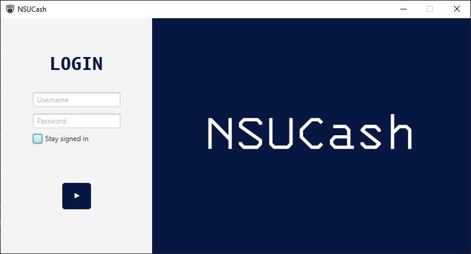
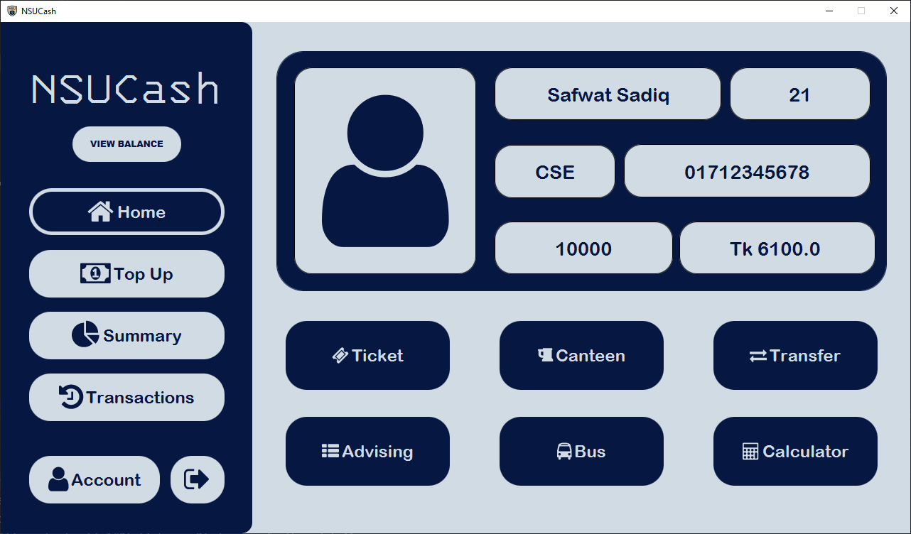
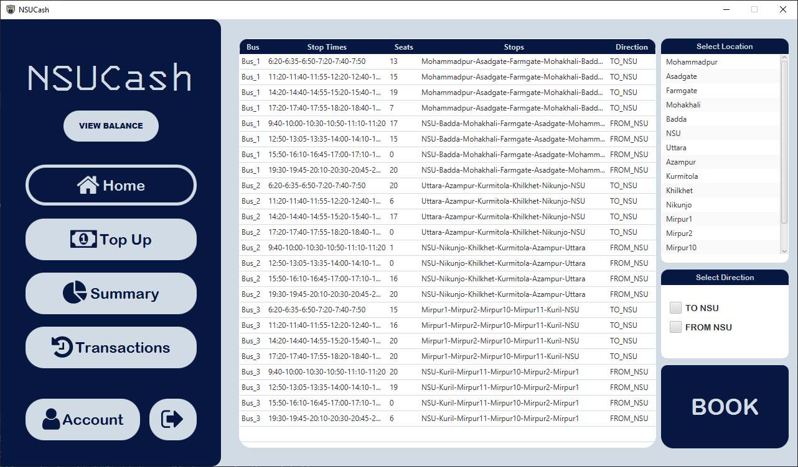
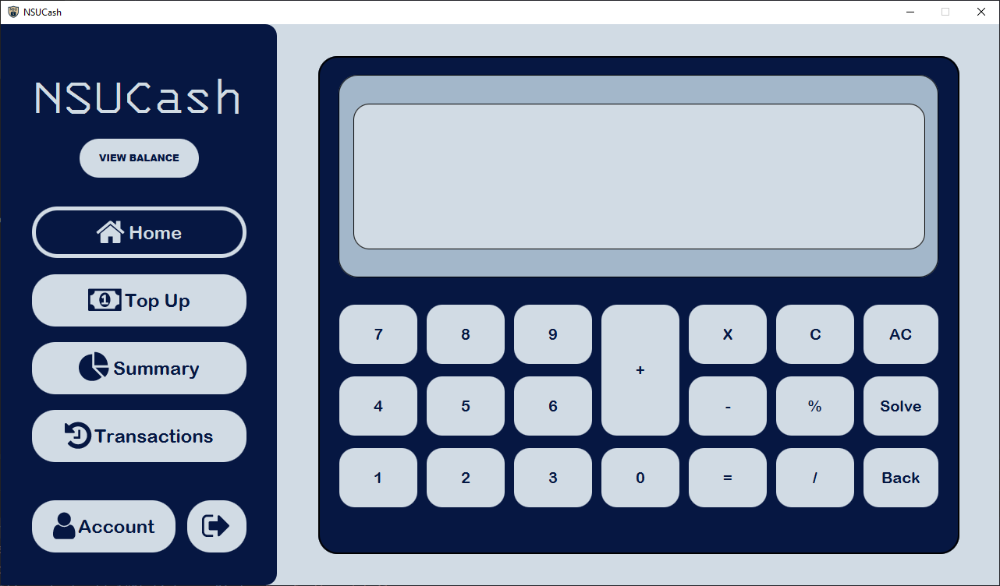
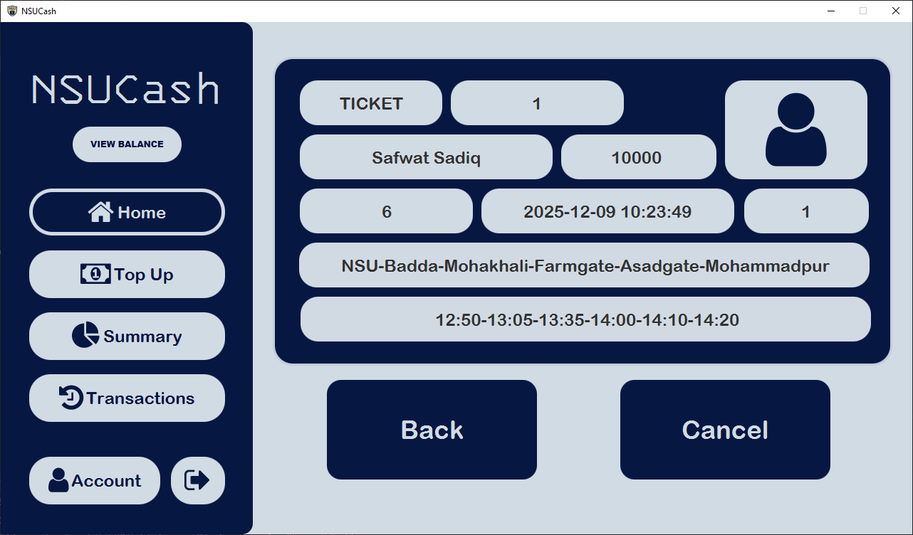
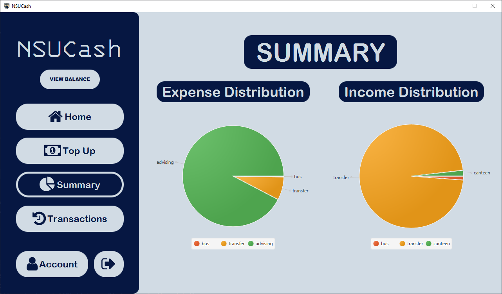
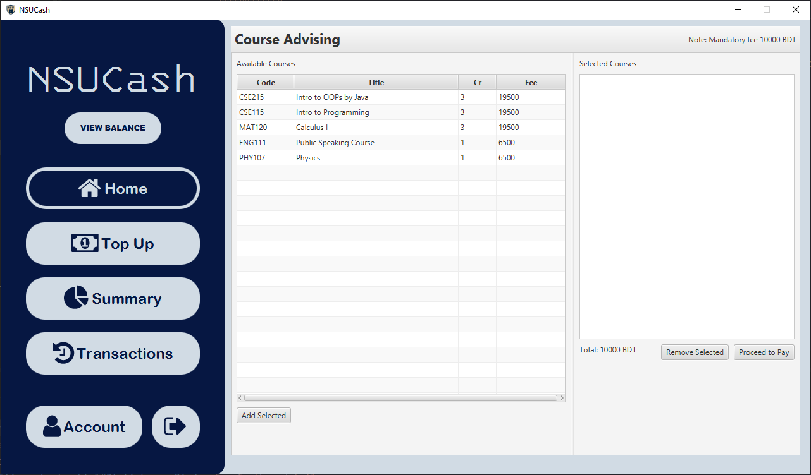
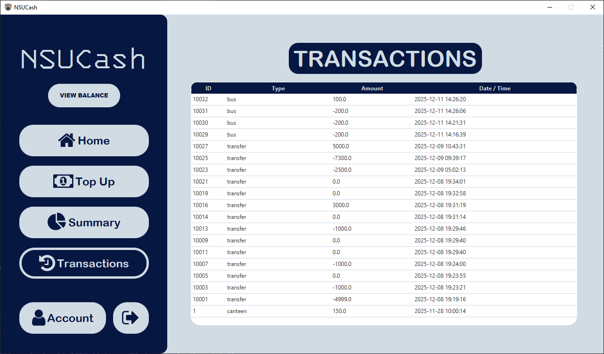

# NSUCash

  

NSUCash is a Java-based application for banking simulation which was made for NSU students. We can give it another name which is Student Wallet System.
This project was developed as a part of CSE215L course under the faculty Shah Mostafa Khaled(STL) to demonstrate core Java skills and real world application logic.

## Table of Contents
1. [About](#about)
2. [Features](#features)
3. [Technologies](#technologies)
4. [Installation](#installation)
5. [Usage](#usage)
6. [Database / Data Model](#database--data-model)
7. [Screenshots](#screenshots)
8. [Contributing](#contributing)

## About

NSUcash is a desktop application that lets student manage their online banking with ease. It lets them do on campus transaction on almost everything.

## Features

List the key features of your application. Examples:

* User authentication (login/register)
* Dashboard showing current balance
* Categorize expenses
* Generate summary reports
* Export data from SQL database
* User can book bus tickets
* Manage expense using calculator
* View and cancel bus ticket anytime
* Transfer money from one account to another with ease

## Technologies

This project uses the following technologies:

* Java 25
* Maven for build automation
* JavaFX
* SQLite

## Installation

**Prerequisites:**

* JDK 25 installed
* Maven installed

## Usage

Describe how a user should interact with the app:

1. Launch the application
2. Register or login
3. Start online banking
4. View summaries
5. Exit the app

## Screenshots
  

  

  

   
